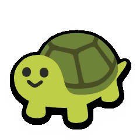

# **Super Auto Pets** 🐶💥🐢  
### _by Dan Kolonay_
 
This is a personal project for practicing frontend web development and css animations. Super Auto Pets is a mobile game which, at the time I made this site, had a very minimal website to promote their game. I decided it would be fun to make a redesign of the site for practice. This site is not affiliated with Super Auto Pets.

---
 

## **Editing the site**

Start by navigating to the project folder and installing dependencies :

    npm install

To get the most out of editing the site in a local environment, you'll need to install the Gatsby CLI globally :

    npm install -g gatsby-cli

Get live updates while editing with gatsby develop and navigating to localhost:8000 in your browser :

    gatsby develop

Compile the production build :

    gatsby build

Documentation for setting up a development environment :  
*https://www.gatsbyjs.com/docs/tutorial/part-0/*
  
---  
 
 
## **Deploying the site**

There are a number of ways to deploy the site listed in the gatsby documentation.  The current build is being hosted through Netlify with auto-updates from a Github repository.

 

After navigating the site to a custom domain, make sure to change the ``siteUrl`` in the gatsby-config.js file.

 

Documentation for deployment :  
*https://www.gatsbyjs.com/docs/deploying-and-hosting/*

  

